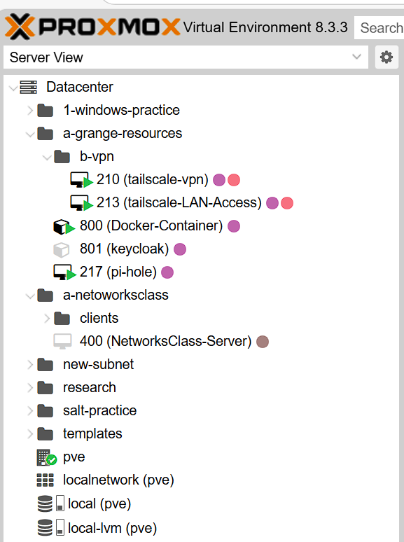

# **Proxmox VE: Enhanced Tag-Based VM Organization (Oz Fork)**  
**Version:** 1.1  
**Maintainer:** Oz Abramovich  
**Original Author:** Gabriel Adams  
**Date:** June 2025  

---

## 🔄 **About This Fork**  

This is a maintained and slightly modified version of the original repository created by **Gabriel Adams**.  
It introduces some fixes and improvements, including instructions for updating `proxmoxlib.js`.

Credit and appreciation go to Gabriel for the original concept and implementation.  
You can find the original project here: [Gabriel’s Repo](https://github.com/gradams42/ProxmoxUpgrades)

---

## **Overview**  

This enhancement improves the **Proxmox Virtual Environment (Proxmox VE)** UI by introducing an **automated, structured folder system** based on **VM and container tags**.  

Instead of a flat resource list, this system dynamically organizes VMs into a **nested directory structure** using their assigned tags, allowing administrators to manage **large-scale Proxmox environments** more efficiently.

---



---

## **Key Features**  

### ✅ Tag-Based Folder Organization  
- The **first tag** defines the parent folder.  
- Additional tags create **nested subfolders**.  
- Tags should be prefixed (`A-`, `B-`, etc.) for consistent sorting and nesting.

Example:
- A-Production → B-Database  
- A-Production → B-WWW  
- A-Test → B-WWW  

This helps maintain the correct hierarchy (`Production → Database`) instead of something unintended like (`Database → Production`).

### 🧹 Automatic Cleanup  
- If a VM loses all tags, it moves back to the default folder.  
- Empty folders are automatically removed.

---

## **Benefits Overview**  

| Feature            | Before                | After                           |
|--------------------|------------------------|----------------------------------|
| VM Organization     | Flat list of VMs       | Hierarchical folders via tags    |
| Folder Naming       | Unstructured           | Uses tag names                   |
| Tag Consistency     | Inconsistent           | Enforced structure               |

---

## 🔧 **Installation & Setup**  

### Step 1: Backup the Existing UI Script  

```bash
cp /usr/share/pve-manager/js/pvemanagerlib.js /usr/share/pve-manager/js/pvemanagerlib.js.bak
```

---

### Step 2: Replace `pvemanagerlib.js`  

```bash
git clone https://github.com/your-username/your-forked-repo.git
cd your-forked-repo
scp pvemanagerlib.js root@your-proxmox-ip:/usr/share/pve-manager/js/
chmod 644 /usr/share/pve-manager/js/pvemanagerlib.js
```

---

### Step 3: Edit `proxmoxlib.js`  

File location:  
```bash
/usr/share/javascript/proxmox-widget-toolkit/proxmoxlib.js
```

#### 1. **Add the following line at line 979**:  
```js
if (!section) return null;
```

This prevents errors in certain UI rendering cases.

#### 2. **Update the version string at the top of the file**:  
Change:
```js
// v4.3.11-t1747226492
```
To:
```js
// v4.3.11-t1747226493
```

This will help bust the frontend cache and load the new JS code.

---

### Step 4: Restart the Proxmox Web Interface  

```bash
systemctl restart pveproxy
systemctl restart pvedaemon
```

---

### Step 5: Force Refresh the Web UI  

Use:  
**`CTRL + Shift + R`**  
to clear your browser’s cache and reload the interface.

---

## 🛠️ Future Plans  

- Improve tag sorting logic (avoid alphabetical override).  
- Make real-time updates even smoother.  
- Better backend-tag communication for true hierarchy support.  
- Seamless integration with Proxmox’s existing tag system and API.

---

## 🙏 Credits  

- **Original Author:** [Gabriel Adams](https://github.com/gradams42)  
- **Maintained Fork by:** Oz Abramovich  
- **Community:** Built for the Open Source Proxmox Community  

---
